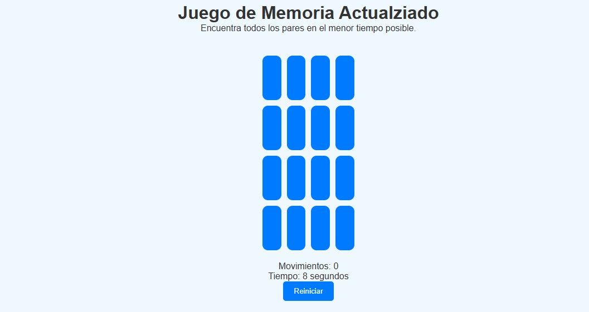

# Juego de Memoria

Un juego interactivo de memoria en el que el objetivo es encontrar todas las parejas de cartas en el menor tiempo y número de movimientos posible.

## Características
- Diseño interactivo con cartas que se voltean.
- Temporizador y contador de movimientos.
- Indicador visual para cartas emparejadas.
